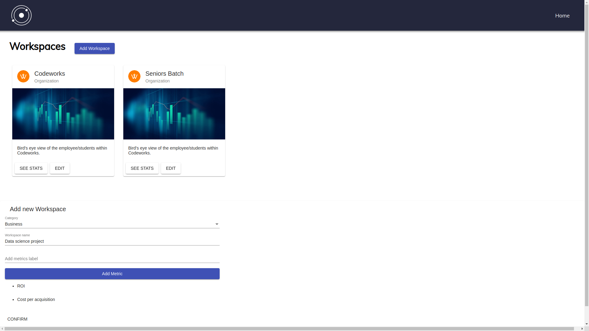

# Orbit

## What is Orbit?
Orbit-server is the back-end for [Orbit](https://github.com/LucaPanzavolta/Orbit-FE) , an open-source data visualisation tool that allows businesses, sports teams and educational institutions track, measure and improve performance. Built using cutting-edge technologies, Orbit provides a birds-eye-view on performance metrics in a way that is easy to understand and digest. Students, players and employees are presented with key changes they can make to improve the performance through a complex neural networks, helping users focus their time more effectively and efficiently.

## Tech Stack

### Front-end: [Orbit-FE](https://github.com/LucaPanzavolta/Orbit-FE)
* [Angular](https://angular.io/)
* [RxJS](https://rxjs-dev.firebaseapp.com/)
* [Chart.js](https://www.chartjs.org/)
* [Angular Material](https://material.angular.io/)

### Back-end

* [Node.js](https://nodejs.org/en/)
* [Koa](https://koajs.com/)
* [MongoDB](https://www.mongodb.com/)
* [Mongoose](https://mongoosejs.com/)
* [Heroku](https://www.heroku.com/)

## Screenshots

## Getting started
After cloning the repo, install the dependencies with:

`npm install`

When the installation is finished, simply lauch the app with:

`ng serve --open`

**Happy hacking!!**

## Contributors
* Uros C - [ross-u](https://github.com/ross-u)
* Luca Panzavolta - [LucaPanzavolta](https://github.com/LucaPanzavolta)

As this is a 100% open source project all contributions and pull requests will be highly welcomed!

